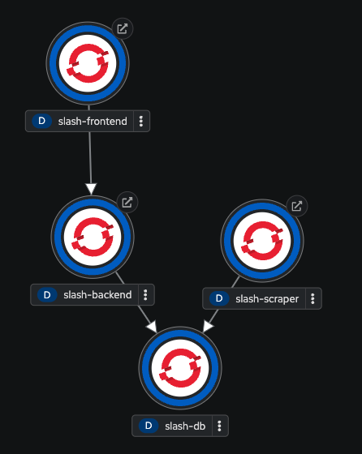

# This documentation details how to get your application onto Openshift (Kubernetes)

## Prerequisites
1. [Red Hat Developer Account](https://developers.redhat.com/)
2. [Quay.io Account](https://quay.io)
3. [Docker](https://docker.io)
4. [Openshift Command Line](https://docs.openshift.com/container-platform/4.8/cli_reference/openshift_cli/getting-started-cli.html)

### What are these files? 
Each of these files contain manifests for our Kubernetes resources. [backend.yaml](backend.yaml) has all the resources for the Quarkus app, [frontend.yaml](frontend.yaml) has the resources for the react app, [scraper.yaml](scraper.yaml) contains resources for the python app, and [database.yaml](database.yaml) has the resources for our database. 

### Deploying your apps
In each of the yaml files they currently point to my quay.io image builds, make sure to build the images locally and then push them to your quay account and then replace the image names in the manifests with your image. The process to deploy is as follows:

1. Log into your Red Hat Developer Account and request an Openshift demo
2. Copy the login command and paste it into your shell, it'll look something like `oc login <info>`
3. In the root directory you can run `docker-compose up` which will build the containers
4. `docker tag slashv2-scraper quay.io/<yourinfohere>`
5. `docker push <imagename>`
6. `cd kubernetes`
7. `oc apply -f database.yaml`
8. `oc apply -f scraper.yaml`
9. `oc apply -f backend.yaml`
10. `oc apply -f frontend.yaml`
11. and now enjoy your app! 

This creates deployments, services, routes, and other resources on your cluster. Read the docs [here](https://kubernetes.io/docs/concepts/cluster-administration/manage-deployment/) and [here](https://docs.openshift.com/) to learn more about Kubernetes and Openshift.

### Finding our app
Our routes are as follows:
1. [The scraper](http://slash-scraper-ifjolla-dev.apps.sandbox-m3.1530.p1.openshiftapps.com/)
2. [The backend](http://slash-backend-ifjolla-dev.apps.sandbox-m3.1530.p1.openshiftapps.com/)
3. [The frontend](http://slash-frontend-ifjolla-dev.apps.sandbox-m3.1530.p1.openshiftapps.com/)

If you get "Application" is not available, change the https to http. If that still doesn't work, then our trial may have run out for Openshift because we only get to host apps 12 hours at a time. We have a video [here]() to show our app on Kubernetes/Openshift and to walk through some of the components.

### Openshift Showcase

Heres our application and some of the componenents on [Openshift](assets/openshift-kubernetes-walkthrough.mov)